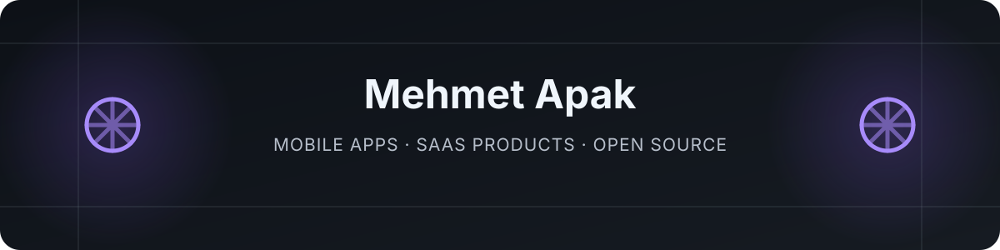

  

  <strong>Building open-source tools that make AI-assisted software development more structured, reviewable, and easier to control.</strong>

  <a href="#featured-projects">Projects</a> ·
  <a href="#what-i-care-about">Principles</a> ·
  <a href="#türkçe">Türkçe</a>

## About

I'm Mehmet Apak. I work on practical orchestration tools for AI-assisted software development, with a focus on clear ownership, bounded workflows, independent verification, and safe defaults.

My current projects provide ready-to-use team structures for **OpenAI Codex** and **Claude Code**. They are independent community projects and are not affiliated with or endorsed by OpenAI or Anthropic.

## Featured projects

| Project | What it provides |
| --- | --- |
| [**Codex Bounded Orchestrator**](https://github.com/metapak/codex-bounded-orchestrator) | A bounded multi-agent workflow for Codex with one owner, explicit write scopes, local task tracking, frozen review candidates, and finite review loops. |
| [**Claude Bounded Orchestrator**](https://github.com/metapak/claude-bounded-orchestrator) | A structured Claude Code workflow that separates exploration, implementation, verification, and review while keeping delegation bounded. |

Both projects include English and Turkish documentation, cross-platform installers, selectable profiles, and optional read-only proposal roles through external model APIs.

## What I care about

- Useful tools with clear, honest documentation
- One accountable owner for each workflow
- Independent verification before completion
- Safe installation, backups, and reversible changes
- Open-source work that people can inspect and improve

## Türkçe

Merhaba, ben Mehmet Apak. Yapay zekâ destekli yazılım geliştirme süreçlerini daha düzenli, denetlenebilir ve kontrollü hâle getiren açık kaynak araçlar geliştiriyorum.

Şu anda Codex ve Claude Code için; inceleme, uygulama ve kontrol görevlerini birbirinden ayıran iki orkestrasyon projesi üzerinde çalışıyorum:

- [Codex Bounded Orchestrator — Türkçe](https://github.com/metapak/codex-bounded-orchestrator/blob/main/README.tr.md)
- [Claude Bounded Orchestrator — Türkçe](https://github.com/metapak/claude-bounded-orchestrator/blob/main/README.tr.md)

Görüş, hata bildirimi ve katkılarınızı ilgili projenin GitHub sayfasından paylaşabilirsiniz.

